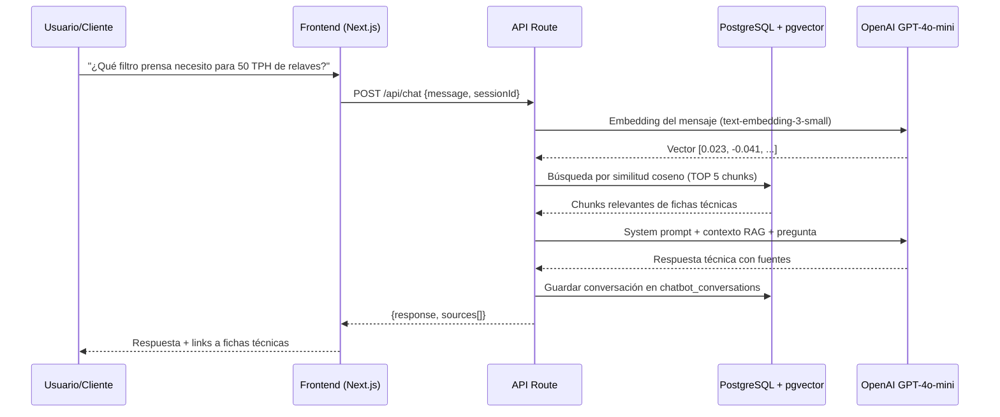
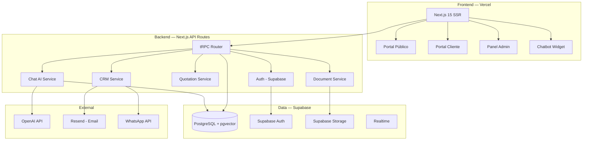

# 🔬 Análisis Brutal — Plataforma Dewatering Solutions

## Veredicto Express

| IA | Nota | Problema principal |
|----|------|--------------------|
| **Gemini** | 6/10 | Lista tecnologías sin justificar. No modela datos. Propone AWS overkill. |
| **Claude** | 8/10 | El mejor análisis técnico. Acertó en Vercel+Supabase. Pero se queda corto en el chatbot IA. |
| **ChatGPT** | 5/10 | Curriculum Vitae de tecnologías. Clean Architecture + DDD + Redis + Terraform + Grafana + Sentry para una web corporativa con CRM es **delirio arquitectónico**. |

---

## 🔴 Lo que TODAS las IAs hicieron mal

### 1. Ninguna definió el modelo de datos
Las tres hablan de PostgreSQL pero **ninguna diseñó las tablas**. Eso es como decir "vamos a construir un edificio" sin planos. El modelo de datos ES la arquitectura real.

### 2. Confunden "impresionar al jurado" con "entregar software"
- ChatGPT propone Clean Architecture + DDD + Redis + Terraform + Grafana + Sentry + pgvector + RAG + CloudFront + Load Balancer... **para una empresa de 10 personas que hoy usa email**.
- Si implementas todo eso, no entregas en 6 meses. No entregas en 12. Punto.

### 3. Nadie habló de UX/UI para el sector minero
El usuario final es un **ingeniero metalúrgico de 45 años** que usa WhatsApp y Excel. No quiere un dashboard de Silicon Valley. Quiere ver sus cotizaciones, descargar sus fichas técnicas, y hablar con alguien rápido.

---

## Análisis Individual

### Gemini — "El Genérico"
**Lo bueno:** Identificó correctamente los módulos funcionales y la necesidad de Scrum.

**Lo malo:**
- Propone Spring Boot O NestJS sin decidirse. Eso no es arquitectura, es menú de restaurante.
- AWS EC2 + RDS + CloudFront para una empresa que hoy no tiene ni web. Eso cuesta mínimo **$120-150/mes** desde el día 1, sin tráfico.
- No menciona el chatbot con IA en la arquitectura real.
- La "justificación empresarial" de cada tecnología es marketing, no ingeniería.

### Claude — "El Pragmático"  
**Lo bueno:** El mejor de los tres. Acertó en:
- NestJS > Spring Boot para este scope (correcto)
- Vercel + Supabase > AWS full (correcto para fase inicial)
- Criticó el GraphQL innecesario (correcto)
- Pidió definir el flujo comercial digitalizado (nadie más lo hizo)

**Lo malo:**
- Se quedó corto en la arquitectura del chatbot IA
- No propuso modelo de datos concreto tampoco
- No definió la estrategia SEO técnica que mencionó como crítica

### ChatGPT — "El Sobreingeniería"
**Lo bueno:** Los módulos empresariales están bien pensados (CRM, Pipeline, Gestión Documental, Portal Cliente).

**Lo malo — y aquí soy brutal:**
- **Clean Architecture + DDD para un CRM de 10 usuarios es absurdo.** DDD existe para dominios complejos con reglas de negocio ambiguas. Aquí el dominio es claro: leads → cotizaciones → proyectos. No necesitas Aggregates, Value Objects ni Bounded Contexts.
- **Redis "para cache de dashboard"** — ¿Qué dashboard? El que va a tener 3 usuarios concurrentes como máximo. PostgreSQL con índices maneja eso sin pestañear.
- **Terraform** — Para gestionar infraestructura que podrías levantar en 10 minutos con un docker-compose.
- **Grafana + Sentry + CloudWatch** — Triple observabilidad para un proyecto que aún no existe. Es como poner 3 alarmas de incendio en una casa que no tiene paredes.
- **Monorepo con turborepo** — Complejidad de configuración para un equipo de 1-3 personas.
- La propuesta **suena** impresionante en papel, pero es **inentregable** en el timeline de una pre-tesis.

---

## 🏗️ Mi Arquitectura Definitiva

> [!IMPORTANT]
> Principio rector: **Entregar software que funcione > Impresionar con buzzwords.**
> El jurado de la tesis se impresiona con un producto funcionando, no con un diagrama de 47 servicios.

### Stack Final — Sin negociación

| Capa | Tecnología | Por qué esta y no otra |
|------|-----------|----------------------|
| **Frontend** | **Next.js 15 + TypeScript + Tailwind CSS** | SSR para SEO (crítico para visibilidad digital). TypeScript evita bugs. Tailwind permite iterar rápido en UI. |
| **UI Components** | **shadcn/ui + Framer Motion** | Componentes accesibles y profesionales. Framer para micro-animaciones que den vida al sitio industrial. |
| **Backend** | **Next.js API Routes + tRPC** | Elimina la necesidad de un backend separado. Type-safety end-to-end. Un solo deploy. Un solo repo. |
| **Base de Datos** | **PostgreSQL (Supabase)** | Supabase da auth, storage, realtime y Postgres manejado. Costo $0 en free tier, $25/mes en pro. |
| **Almacenamiento** | **Supabase Storage** | Para fichas técnicas, PDFs, fotos de equipos. Incluido en Supabase, no necesitas S3 separado. |
| **Chatbot IA** | **Vercel AI SDK + OpenAI + pgvector** | RAG sobre fichas técnicas y manuales. pgvector viene integrado en Supabase. Sin infraestructura extra. |
| **Email** | **Resend** | Emails transaccionales (confirmación de cotización, notificaciones). Free tier generoso. |
| **WhatsApp** | **API de WhatsApp Business (Meta)** | Integración directa para notificaciones de cotizaciones. |
| **Deploy** | **Vercel** | Deploy automático desde GitHub. Preview por PR. SSL incluido. CDN global. $0 hasta que escales. |
| **CI/CD** | **GitHub Actions** | Lint + Tests + Deploy automático a Vercel. |

### ¿Por qué NO Spring Boot?

No es que Java sea malo — tú ya dominas Spring Boot y MainRoot lo demuestra. Pero para **este proyecto específico**:

1. **Dos deploys vs uno** — Con Spring Boot necesitas deploy del frontend (Vercel) + backend (AWS/Railway/Render). Con Next.js API Routes, es **un solo deploy** en Vercel.
2. **Dos repos vs uno** — Menos complejidad de CI/CD, menos configuración de CORS, menos puntos de fallo.
3. **Type-safety rota** — Con Spring Boot + Next.js, los tipos del backend (Java) y frontend (TypeScript) no se comparten. Con tRPC, si cambias un endpoint, TypeScript te grita en el frontend instantáneamente.
4. **Tiempo** — Es pre-tesis. Necesitas entregar. Spring Boot añade 30-40% más tiempo de desarrollo para el mismo resultado.

> [!TIP]
> Para tu tesis, puedes argumentar la decisión así: *"Se evaluaron alternativas enterprise como Spring Boot, pero se priorizó la velocidad de entrega y la cohesión del stack TypeScript end-to-end, reservando la migración a microservicios Java como trabajo futuro documentado en el roadmap."*

### ¿Por qué NO Redis, Terraform, Grafana, Sentry?

Porque **no los necesitas hasta tener usuarios reales**. La regla de oro:

```
Complejidad prematura = Deuda técnica disfrazada de "buenas prácticas"
```

Cuando tengas 100 usuarios concurrentes, agregas Redis. Cuando tengas 3 servidores, agregas Terraform. Cuando tengas errores en producción que no puedes reproducir, agregas Sentry. **No antes.**

---

## 📊 Modelo de Datos (Lo que nadie te dio)

```sql
-- ========================================
-- MODELO DE DATOS — DEWATERING SOLUTIONS
-- ========================================

-- 1. Usuarios del sistema (Admin, Comercial, Ingeniero, Cliente)
CREATE TABLE users (
    id UUID PRIMARY KEY DEFAULT gen_random_uuid(),
    email VARCHAR(255) UNIQUE NOT NULL,
    password_hash VARCHAR(255) NOT NULL,
    full_name VARCHAR(200) NOT NULL,
    phone VARCHAR(20),
    company VARCHAR(200),          -- Para clientes: nombre de su empresa
    position VARCHAR(100),         -- Cargo del contacto
    role VARCHAR(20) NOT NULL DEFAULT 'CLIENT',  
    -- SUPER_ADMIN | ADMIN | COMMERCIAL | ENGINEER | CLIENT
    is_active BOOLEAN DEFAULT TRUE,
    avatar_url TEXT,
    created_at TIMESTAMPTZ DEFAULT NOW(),
    updated_at TIMESTAMPTZ DEFAULT NOW()
);

-- 2. Categorías de servicios
CREATE TABLE service_categories (
    id SERIAL PRIMARY KEY,
    name VARCHAR(100) NOT NULL,       -- "Filtración", "Espesamiento", etc.
    slug VARCHAR(100) UNIQUE NOT NULL, -- "filtracion", "espesamiento"
    description TEXT,
    icon VARCHAR(50),                  -- Nombre del ícono Lucide
    sort_order INT DEFAULT 0,
    is_active BOOLEAN DEFAULT TRUE
);

-- 3. Servicios ofrecidos
CREATE TABLE services (
    id SERIAL PRIMARY KEY,
    category_id INT REFERENCES service_categories(id),
    name VARCHAR(200) NOT NULL,
    slug VARCHAR(200) UNIQUE NOT NULL,
    short_description TEXT,           -- Para cards del catálogo
    full_description TEXT,            -- Para la página detalle
    image_url TEXT,
    is_featured BOOLEAN DEFAULT FALSE,
    is_active BOOLEAN DEFAULT TRUE,
    sort_order INT DEFAULT 0,
    created_at TIMESTAMPTZ DEFAULT NOW()
);

-- 4. Productos / Equipos
CREATE TABLE products (
    id SERIAL PRIMARY KEY,
    name VARCHAR(200) NOT NULL,
    slug VARCHAR(200) UNIQUE NOT NULL,
    category VARCHAR(100),            -- "Filtros Prensa", "Bombas", etc.
    short_description TEXT,
    full_description TEXT,
    specifications JSONB,             -- Ficha técnica estructurada
    origin VARCHAR(50),               -- "Italia", "Sudáfrica"
    image_urls TEXT[],                -- Array de URLs de imágenes
    datasheet_url TEXT,               -- URL del PDF descargable
    is_active BOOLEAN DEFAULT TRUE,
    sort_order INT DEFAULT 0,
    created_at TIMESTAMPTZ DEFAULT NOW()
);

-- 5. Leads / Solicitudes de contacto
CREATE TABLE leads (
    id SERIAL PRIMARY KEY,
    -- Datos del prospecto
    contact_name VARCHAR(200) NOT NULL,
    contact_email VARCHAR(255) NOT NULL,
    contact_phone VARCHAR(20),
    company_name VARCHAR(200),
    company_sector VARCHAR(100),       -- "Minería", "Industrial", etc.
    -- Contexto de la solicitud
    source VARCHAR(50) DEFAULT 'WEB', -- WEB | WHATSAPP | REFERRAL | EVENT
    service_interest TEXT,             -- Qué servicio le interesa
    message TEXT,
    -- Pipeline CRM
    status VARCHAR(30) DEFAULT 'NEW', 
    -- NEW | CONTACTED | EVALUATING | PROPOSAL | NEGOTIATION | WON | LOST
    assigned_to UUID REFERENCES users(id),  -- Comercial asignado
    priority VARCHAR(10) DEFAULT 'MEDIUM',  -- LOW | MEDIUM | HIGH | URGENT
    -- Seguimiento
    next_follow_up DATE,
    lost_reason TEXT,                  -- Si se perdió, por qué
    created_at TIMESTAMPTZ DEFAULT NOW(),
    updated_at TIMESTAMPTZ DEFAULT NOW()
);

-- 6. Cotizaciones
CREATE TABLE quotations (
    id SERIAL PRIMARY KEY,
    lead_id INT REFERENCES leads(id),
    quotation_number VARCHAR(20) UNIQUE NOT NULL, -- "COT-2026-0042"
    version INT DEFAULT 1,
    -- Contenido
    title VARCHAR(300) NOT NULL,
    description TEXT,
    items JSONB NOT NULL,              -- Array de ítems con precio
    subtotal DECIMAL(12,2),
    tax DECIMAL(12,2),
    total DECIMAL(12,2),
    currency VARCHAR(3) DEFAULT 'PEN', -- PEN | USD
    valid_until DATE,
    -- Estado
    status VARCHAR(20) DEFAULT 'DRAFT',
    -- DRAFT | SENT | VIEWED | APPROVED | REJECTED | EXPIRED
    -- Archivos
    pdf_url TEXT,
    -- Metadata
    created_by UUID REFERENCES users(id),
    approved_by UUID REFERENCES users(id),
    created_at TIMESTAMPTZ DEFAULT NOW(),
    updated_at TIMESTAMPTZ DEFAULT NOW()
);

-- 7. Proyectos (post-venta)
CREATE TABLE projects (
    id SERIAL PRIMARY KEY,
    quotation_id INT REFERENCES quotations(id),
    client_id UUID REFERENCES users(id),
    project_number VARCHAR(20) UNIQUE NOT NULL, -- "PRJ-2026-0015"
    title VARCHAR(300) NOT NULL,
    description TEXT,
    status VARCHAR(20) DEFAULT 'PLANNING',
    -- PLANNING | IN_PROGRESS | ON_HOLD | COMPLETED | CANCELLED
    start_date DATE,
    end_date DATE,
    assigned_engineer UUID REFERENCES users(id),
    created_at TIMESTAMPTZ DEFAULT NOW(),
    updated_at TIMESTAMPTZ DEFAULT NOW()
);

-- 8. Documentos (fichas técnicas, informes, certificados)
CREATE TABLE documents (
    id SERIAL PRIMARY KEY,
    title VARCHAR(300) NOT NULL,
    description TEXT,
    category VARCHAR(50),             -- DATASHEET | REPORT | CERTIFICATE | MANUAL | OTHER
    file_url TEXT NOT NULL,
    file_size INT,                     -- bytes
    file_type VARCHAR(20),             -- pdf, docx, etc.
    -- Acceso
    is_public BOOLEAN DEFAULT FALSE,   -- ¿Visible sin login?
    project_id INT REFERENCES projects(id), -- Si pertenece a un proyecto
    product_id INT REFERENCES products(id), -- Si es ficha de un producto
    -- Metadata
    uploaded_by UUID REFERENCES users(id),
    download_count INT DEFAULT 0,
    created_at TIMESTAMPTZ DEFAULT NOW()
);

-- 9. Mensajes del Chatbot (para entrenar y mejorar)
CREATE TABLE chatbot_conversations (
    id SERIAL PRIMARY KEY,
    session_id VARCHAR(100) NOT NULL,
    user_id UUID REFERENCES users(id), -- NULL si es visitante anónimo
    user_message TEXT NOT NULL,
    bot_response TEXT NOT NULL,
    sources JSONB,                     -- Documentos usados como contexto RAG
    feedback VARCHAR(10),              -- HELPFUL | NOT_HELPFUL
    created_at TIMESTAMPTZ DEFAULT NOW()
);

-- 10. Audit Log
CREATE TABLE audit_logs (
    id SERIAL PRIMARY KEY,
    user_id UUID REFERENCES users(id),
    action VARCHAR(50) NOT NULL,
    entity VARCHAR(50) NOT NULL,
    entity_id VARCHAR(50),
    old_data JSONB,
    new_data JSONB,
    ip_address VARCHAR(45),
    created_at TIMESTAMPTZ DEFAULT NOW()
);

-- 11. Embeddings para RAG (pgvector)
CREATE TABLE document_embeddings (
    id SERIAL PRIMARY KEY,
    document_id INT REFERENCES documents(id) ON DELETE CASCADE,
    chunk_index INT NOT NULL,          -- Orden del chunk en el documento
    chunk_text TEXT NOT NULL,           -- Texto original del chunk
    embedding vector(1536),            -- OpenAI text-embedding-3-small
    metadata JSONB,                    -- Título del doc, página, etc.
    created_at TIMESTAMPTZ DEFAULT NOW()
);

-- Índice para búsqueda de similitud
CREATE INDEX idx_embeddings_vector ON document_embeddings 
    USING ivfflat (embedding vector_cosine_ops) WITH (lists = 100);
```

---

## 🤖 Arquitectura del Chatbot IA (RAG)

> [!IMPORTANT]
> Este es el diferenciador real del proyecto. Ninguna empresa de separación sólido-líquido en Perú tiene un chatbot técnico entrenado con sus propios datos.

### Flujo del Chatbot



### Datos de Entrenamiento (RAG)

El chatbot NO se entrena como un modelo personalizado. Usa **Retrieval Augmented Generation**:

1. **Ingestión**: Subes fichas técnicas, manuales, catálogos como PDFs
2. **Chunking**: Se dividen en fragmentos de ~500 tokens
3. **Embedding**: Cada chunk se convierte en un vector con OpenAI
4. **Storage**: Los vectores se guardan en `document_embeddings` (pgvector)
5. **Query**: Cuando el usuario pregunta, se buscan los chunks más similares
6. **Generation**: GPT-4o-mini genera la respuesta usando esos chunks como contexto

### System Prompt del Chatbot

```
Eres el asistente técnico virtual de Dewatering Solutions, empresa peruana 
especializada en separación sólido-líquido para la industria minera.

REGLAS:
- Responde SOLO con información de los documentos proporcionados como contexto.
- Si no tienes información suficiente, di: "Para este requerimiento específico, 
  le recomiendo contactar a nuestro equipo técnico" y ofrece el formulario.
- Usa terminología técnica pero explicada de forma clara.
- Si el usuario pregunta precios, redirige a cotización.
- Idioma: Español profesional.
- Siempre menciona las fuentes (nombre del documento).
```

### Costo estimado del chatbot

| Componente | Costo mensual |
|-----------|--------------|
| OpenAI GPT-4o-mini (respuestas) | ~$5-15 (según uso) |
| OpenAI Embeddings | ~$1-3 (solo al ingestar docs nuevos) |
| pgvector en Supabase | $0 (incluido en Supabase Pro $25/mes) |
| **Total** | **~$6-18/mes** |

> Comparar con la propuesta de ChatGPT que sugería AWS completo a $120-150/mes **sin el chatbot**.

---

## 📐 Arquitectura del Sistema Completo



---

## 🗓️ Plan de Ejecución — 5 Sprints (10 semanas)

### Sprint 1 (Sem 1-2): Fundamentos
- Setup del proyecto Next.js + Supabase + tRPC
- Modelo de datos completo (migrate)
- Auth con Supabase (roles RBAC)
- Layout principal + Design System (Azul/Plomo)
- Landing page hero + página "Nosotros"

### Sprint 2 (Sem 3-4): Portal Público
- Catálogo de servicios (SSR para SEO)
- Catálogo de productos con fichas técnicas
- Formulario de contacto/cotización → email + WhatsApp
- SEO técnico (sitemap, meta tags, structured data)

### Sprint 3 (Sem 5-6): CRM + Panel Admin
- Dashboard ejecutivo con KPIs
- CRUD de leads con pipeline visual (Kanban)
- Generación y gestión de cotizaciones
- Gestión documental (upload/download)
- Audit logs

### Sprint 4 (Sem 7-8): Portal Cliente + Chatbot IA
- Portal B2B para clientes (ver proyectos, documentos, historial)
- Ingestión de documentos → embeddings → pgvector
- Chatbot RAG funcional con widget en el frontend
- Guardar conversaciones + feedback

### Sprint 5 (Sem 9-10): Pulido + Deploy
- Testing end-to-end
- Optimización de performance (Lighthouse 90+)
- Docker Compose para desarrollo local
- Deploy producción en Vercel + Supabase Pro
- Documentación de la tesis

---

## 🎯 Diferenciadores vs las otras propuestas

| Aspecto | Gemini | Claude | ChatGPT | **Mi propuesta** |
|---------|--------|--------|---------|-----------------|
| Modelo de datos | ❌ | ❌ | ❌ | ✅ 11 tablas diseñadas |
| Chatbot IA concreto | ❌ | Mencionado | Mencionado | ✅ RAG + pgvector + prompt |
| Entregable en 10 sem | Dudoso | Probable | ❌ Imposible | ✅ 5 sprints claros |
| Costo mensual prod | $120-150 | $25-50 | $150-200+ | **$25-43** |
| Deploys necesarios | 2-3 | 2 | 3-4 | **1 (Vercel)** |
| Complejidad de infra | Alta | Media | Extrema | **Baja** |

---

## 💰 Costo Total Estimado en Producción

| Servicio | Plan | Costo/mes |
|----------|------|-----------|
| Vercel | Pro | $20 |
| Supabase | Pro | $25 |
| OpenAI API | Pay-as-you-go | $6-18 |
| Resend | Free (3k emails/mes) | $0 |
| Dominio (.com) | Anual | ~$1/mes |
| **TOTAL** | | **$52-64/mes** |

> vs AWS (EC2+RDS+S3+CloudFront) que ChatGPT propone: **$150-250/mes mínimo**

---

> [!CAUTION]
> **La trampa más peligrosa en proyectos de tesis**: Diseñar una arquitectura "enterprise" que nunca se termina de implementar. El jurado evalúa software funcionando, no diagramas de PowerPoint. Mi propuesta prioriza **entregar** sobre **impresionar con complejidad**.
